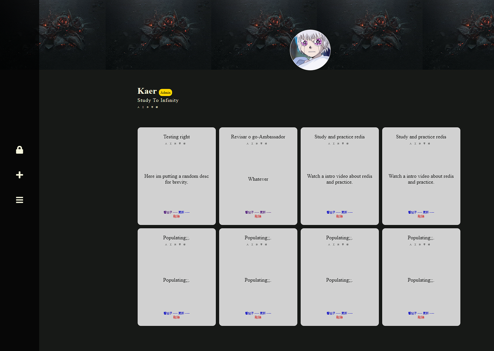

# BlogOrm




> Um blog simples com CRUD para posts (posts tem muito a melhorar).


### Ajustes e melhorias

O projeto foi criado enquanto eu estudava SQL e tinha como objetivo inicial ser apenas um blog com operações simples,
porém acabou virando um frankstein e eu vou adicionando novas coisas nele conforme eu vou as estudando. 

- [ ] Criar um mecanismo de amizades.
- [ ] Likes nos posts.
- [ ] Posts com opção de ser público ou privado.

## 💻 Pré-requisitos

Antes de começar, verifique se você atendeu aos seguintes requisitos:
* Você instalou a versão mais recente de `< Go e Docker >`

## 🚀 Instalando <blogorm>

Para instalar o <blogorm>, siga estas etapas:

Linux e macOS:
```
<$ git clone "linkDoProjeto">
```

Windows:
```
<$ git clone "linkDoProjeto">
```

## ☕ Usando <blogorm>

Para usar <blogorm>, siga estas etapas:

* Crie um arquivo .env e coloque as seguintes variaveis com os respectivos valores
   * MYSQL_ROOT_PASSWORD=
   * DB_PASSWORD=
   * DB_HOST=
   * DB_PORT=
   * DB_NAME=
   * SERVER_PORT=
   * ENVIRONMENT=<prod / dev / local>


```
<docker-compose up --build>
```

